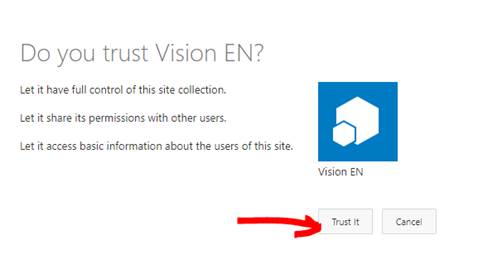

# SharePoint-ClientId-Secret-Authentication (SharePoint Online)

SharePoint Online Azure Access Control (ACS) Authentication. How to get AppOnlyAccessToken?

## How to register an app?

- Go to https://contoso.sharepoint.com/sites/mysite/_layouts/appregnew.aspx
- Register ClientID and Secret
- Domain and redirect URI does not matter when we use the secret
- Go to https://contoso.sharepoint.com/sites/mysite/_layouts/appinv.aspx
- Paste the client ID and click the lookup button
- In the `Permission Request XML` input add:
```xml
<AppPermissionRequests AllowAppOnlyPolicy="true">
    <AppPermissionRequest Scope="http://sharepoint/content/sitecollection" Right="FullControl" />
</AppPermissionRequests>
```
- Scope of `http://sharepoint/content/sitecollection` means site collection level of permissions. 
- The `http://sharepoint/content/sitecollection` must remain as is. This is not a real tenant SharePoint url.
- Rights can be FullControl, Manage, Write, Read.
- Give the minimum rights needed
- Click the create button
- You must see this window

- Trust it.
- To verify that Is trusted go to https://contoso.sharepoint.com/sites/mysite/_layouts/appprincipals.aspx and see if it is listed
 

## How to get the AppOnlyAccessToken token?

It is single HTTP request:

```
POST:

https://accounts.accesscontrol.windows.net/contoso.onmicrosoft.com/tokens/OAuth/2

HEADERS:

content-type application/x-www-form-urlencoded

FORM DATA (URLSearchParams fromat):

grant_type=client_credentials

&resource=00000003-0000-0ff1-ce00-000000000000/contoso.sharepoint.com@contoso.onmicrosoft.com

&client_id=0cc5eb23-ec9e-4dee-937b-b0fd4b5994a8@contoso.onmicrosoft.com

&client_secret=uYDy8GEfw/CCDr2BBTitoRuedsGa7veIKTW2W7ZSMT8=

&scope=00000003-0000-0ff1-ce00-000000000000/contoso.sharepoint.com@contoso.onmicrosoft.com

```

#### Additional Notes:
- 00000003-0000-0ff1-ce00-000000000000 – never changes. This is Office 365 guid
- **You have to replace contoso.onmicrosoft.com with other tenant ID** where is present to make it work for other tenants. **INCLUDING the post request URL**.
- **You have to replace contoso.sharepoint.com with <OTHER_TENANT>.sharepoint.com** where is present to make it work for other tenants
- Client ID appends the tenant ID separated by @. You might easily miss it.
- The Secrets have expiry by default expiration is 1 year. You will then have to generate new app.

## How to run this example?

- Have nodejs installed 
- Have GIT installed 
- Open command line and run
- Run `git clone https://github.com/VelinGeorgiev/SharePoint-ClientId-Secret-Authentication`
- Run `cd SharePoint-ClientId-Secret-Authentication`
- Run `npm i`
- Open the `index.js`
- Change `tenantId`, `sharePointDomain`, `sharePointSiteUrl`, `clientId` and `secret` with yours
- Run `node index.js` from the command line

## SharePoint Scopes and Rights

| Scope                                             | Available rights                 |
|---------------------------------------------------|----------------------------------|
| http://sharepoint/content/sitecollection          | Read, Write, Manage, FullControl |
| http://sharepoint/content/sitecollection/web      | Read, Write, Manage, FullControl |
| http://sharepoint/content/sitecollection/web/list | Read, Write, Manage, FullControl |
| http://sharepoint/content/tenant                  | Read, Write, Manage, FullControl |
| http://sharepoint/social/tenant                   | Read, Write, Manage, FullControl |
| http://sharepoint/taxonomy                        | Read, Write                      |
| http://sharepoint/search	                        | QueryAsUserIgnoreAppPrincipal    |

*http://sharepoint/social/tenant - is the User Profiles API

*More here [Add-in permissions in SharePoint
](https://docs.microsoft.com/en-us/sharepoint/dev/sp-add-ins/add-in-permissions-in-sharepoint)


## Usefull links: 

[Add-in Permissions](https://docs.microsoft.com/en-us/sharepoint/dev/sp-add-ins/add-in-permissions-in-sharepoint)

[ACS Authorization flow in case your app should act on behalf of user](https://docs.microsoft.com/en-us/sharepoint/dev/sp-add-ins/authorization-code-oauth-flow-for-sharepoint-add-ins#step-2-the-add-in-redirects-to-the-sharepoint-site-authorization-url)

[Good C# SharePoint CSOM example](https://github.com/SharePoint/PnP/tree/master/Samples/Core.RestFileUpload) - Might have to run `Update-Package -reinstall` to make it build.

[Create SharePoint app registration with client secret which never expires](https://spblog.net/post/2018/08/24/SharePoint-lifehacks-create-SharePoint-app-registration-with-client-secret-which-never-expires) - Not recommended, but possible.

## Remember

This repository is just a example that can quickly move you up and running. DO NOT Hardcore your `Secret` for production, KEEP IT save, MOVE it to a secure KEY VAULT and fetch it from there in a secure way!